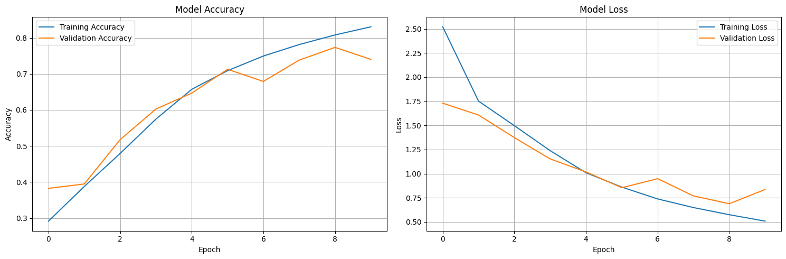
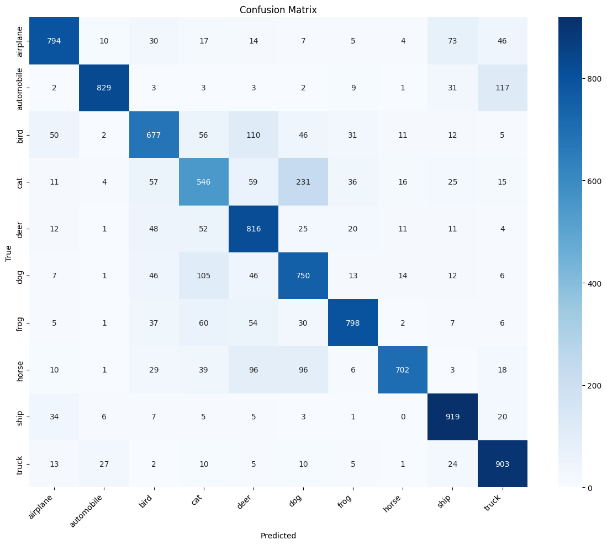
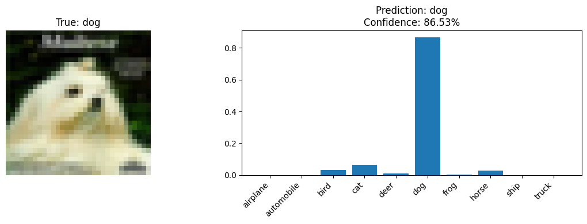
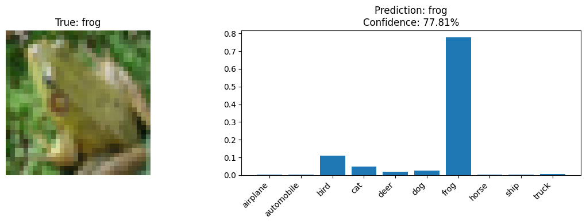
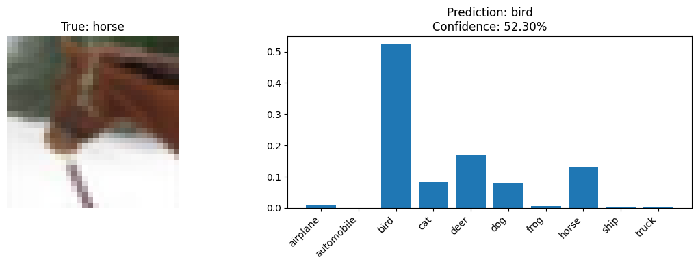
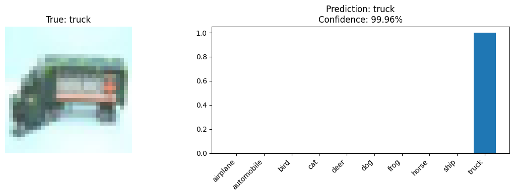
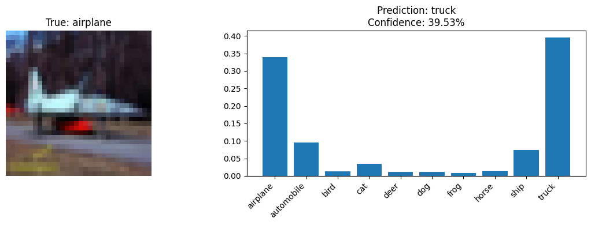

In this project, i've tried implementing the AlexNet Architecture, using tensorflow Keras.

At first I tried to train the model on the same image dataset as the original AlexNet (ImageNet dataset)

But since the ImageNet API endpoints I was trying to use are no longer publicly accessible, I couldn't access URLs from ImageNet.

So I resorted to using the TensorFlow Datasets (CIFAR-10 dataset) instead of manually downloading ImageNet images. This is because this dataset was readily available and well-maintained.

I made sure to include proper data preprocessing and batching, and made sure to Implement a modified AlexNet architecture suitable for smaller images (277x277).

After training for 10 epoches, the model achieves a Test Accuracy of 77.34%

We can see from the trainig accuracy plot that the model was still learning, without getting to diminishing returns, so we can say that there is still potential for improvement.

You can look at the classification matrix below to get an idea of how well the model performs, and what are its weak points.

Performance Matrix:

As you can see the model performs generally well on classifying images and mostly gets them wrong when thing which are of similar concepts are used (example cats from dogs) this is likely due to the fact that the dataset has pretty low quality images (and cats and dogs have a similar rough structure) and thus its not being able to make out from the pixilated images about which is which.

A few Examples:

i would say it did a pretty decent job of recognizing this one

this one is good too

it fails at this one likely because the whole body of the horse is not visible in the picture

i would say it did a great job here at recogniting this truck, i personally could not understand how it did that

it tried but failed here, but it was a close one...

so you can see the model is decent but there is still a room for improvement

Perhaps in the future, if I get access to better hardware resources, I can traing a better model with a larger and higher quality dataset and more training time, but as of now this implementation stands as a great exercise for me to understand the basics of Deep Learning systems.
